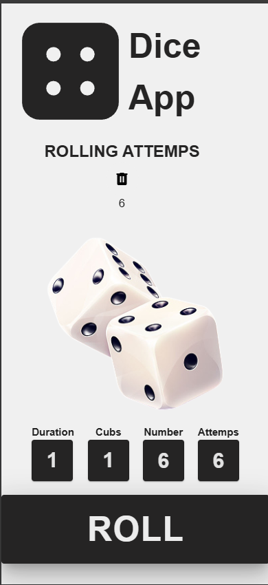
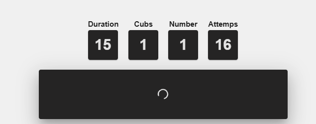
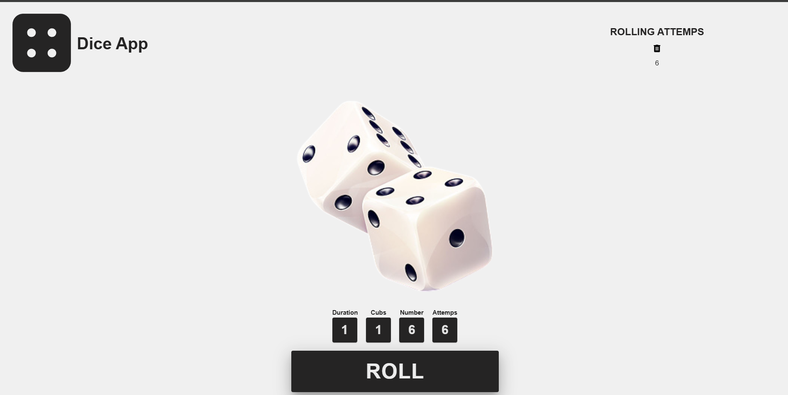
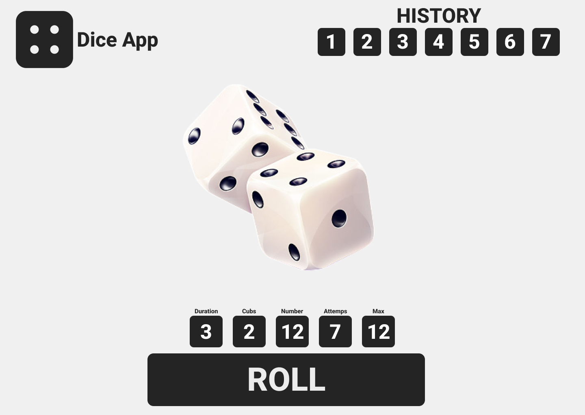

# Dice App

Простейшее приложение на Vue

> Мобильная версия сделана хуже

## Если хотите запустить

```bash
git clone https://github.com/Ayomits/Dice-App.git
cd frontend
npm i
npm run dev
```

## Stack

<ol>
  <li>Vue</li>
  <li>Pinia</li>
  <li>Vuetify</li>
  <li>Tailwind</li>
</ol>

## Скриншоты с приложения





## Объяснение свойств

`Duration` - длительность анимации дайсинга
`Cubs` - количество кубиков
`Number` - выпадшее число
`Attemps` - количество прокрутов

## Изначальный дизайн



## Почему поменял и отказал от чего-то?

Я просто не хотел долго делать этот проект и стало чутка лениво. Поэтому нет истории, а очень хотелось + фича будто бы юзлес <br>
Также нет анимации рола. Только кнопка становится лоадером
